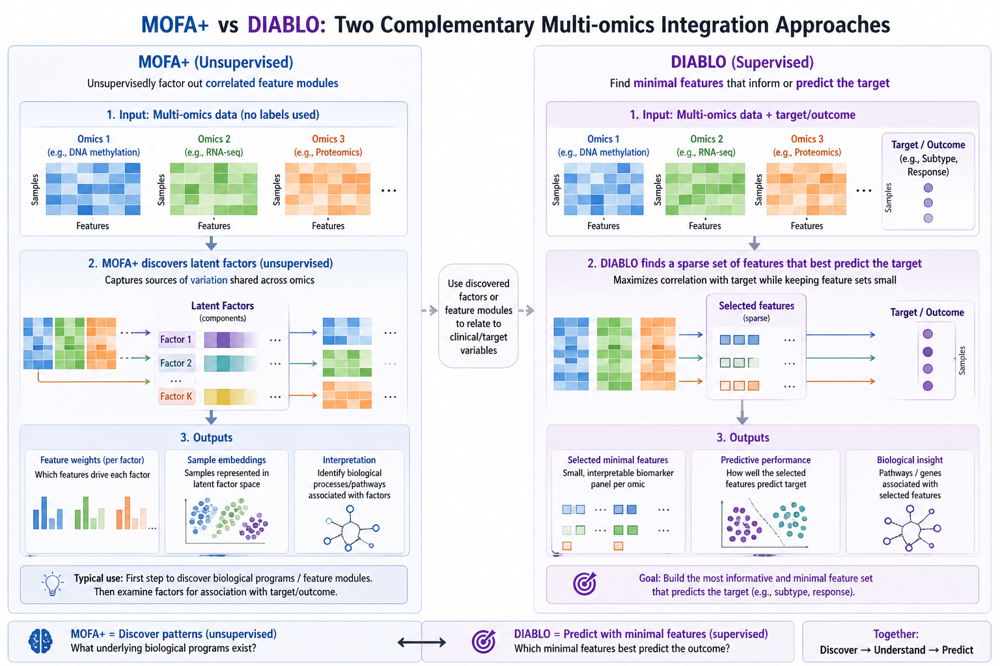
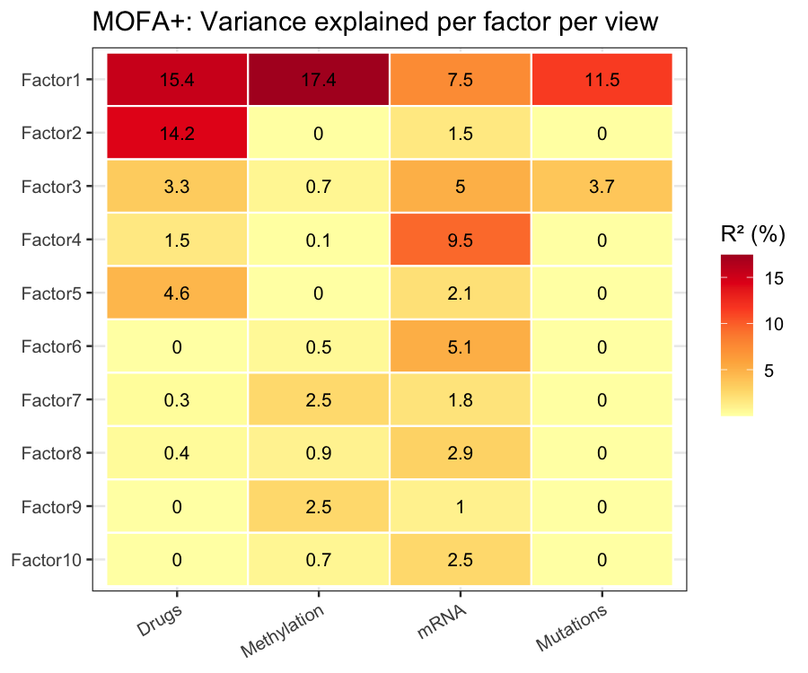
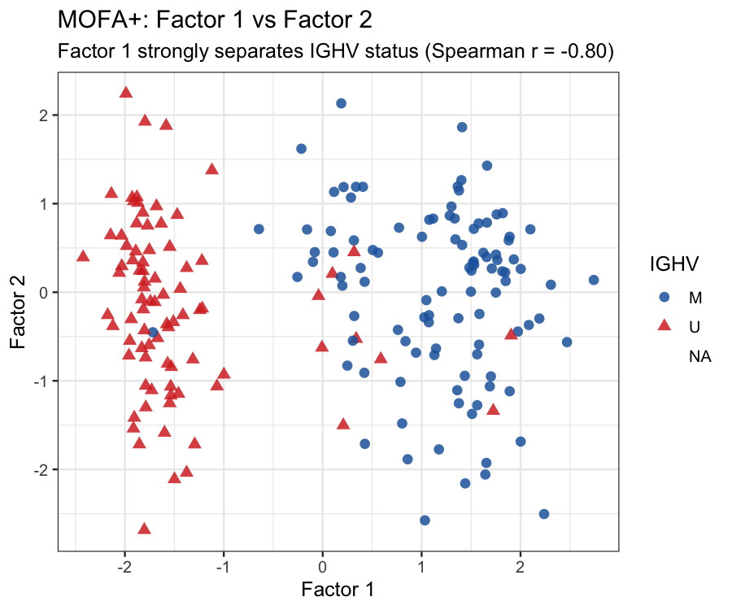
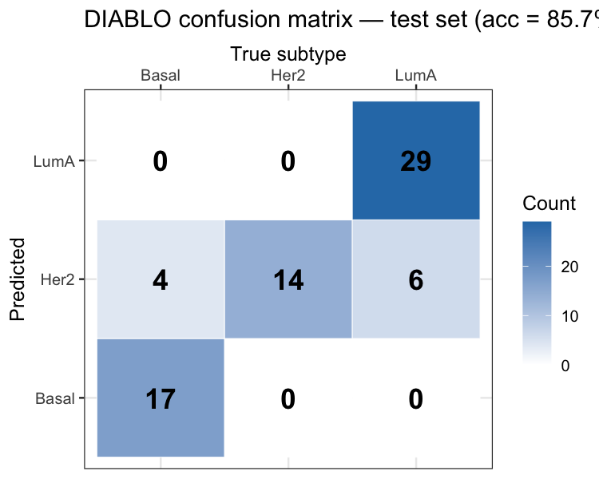
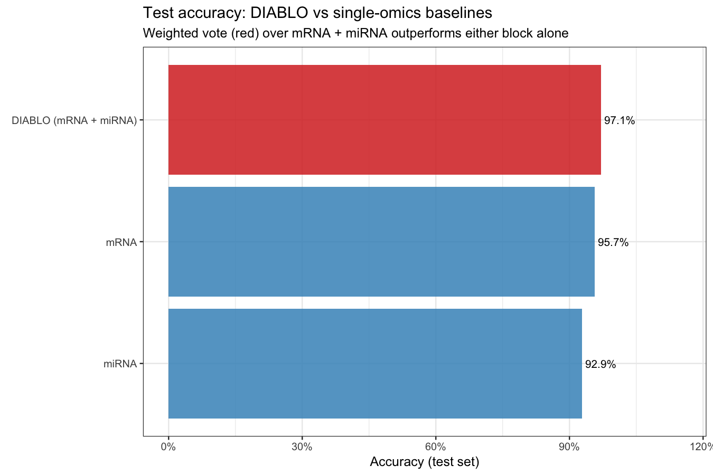

# Multiomics Integration Demo

Two end-to-end multi-omics integration analyses demonstrating complementary methodologies
for unsupervised and supervised integration, using real public datasets bundled in R packages.



---

## Analyses

| # | Method | Dataset | Biological question |
|---|--------|---------|-------------------|
| 1 | **MOFA+** (unsupervised) | CLL — `MOFA2::CLL_data` | What molecular signatures across DNA methylation, RNA-seq, and drug response explain CLL patient heterogeneity and treatment response? |
| 2 | **DIABLO** (supervised) | breast.TCGA — `mixOmics::breast.TCGA` | What minimal multi-omics biomarker panel best discriminates PAM50 breast cancer subtypes? |

> **On dataset choice:** `CLL_data` and `breast.TCGA` are the canonical tutorial
> datasets from the official MOFA2 and mixOmics package vignettes respectively.
> They are used here deliberately — the biology is well-characterised, results
> are verifiable against published benchmarks (Argelaguet et al. 2020; Singh et al. 2019),
> and they allow the focus to remain on methodology and reproducibility rather than
> data wrangling. The repo goes beyond the vignettes in its reproducibility stack
> (Docker, conda, papermill, CI), biological commentary, and direct comparison of
> the two methods as complementary tools.

---

## Repository Structure

```
.
├── notebooks/                              # Jupyter notebooks (R kernel)
│   ├── 01_mofa_cll/
│   │   ├── 01_data_loading_eda.ipynb
│   │   ├── 02_mofa_training.ipynb
│   │   ├── 03_factor_analysis.ipynb
│   │   └── 04_biological_interpretation.ipynb
│   ├── 02_diablo_brca/
│   │   ├── 01_data_loading_eda.ipynb
│   │   ├── 02_single_omics_baseline.ipynb
│   │   ├── 03_diablo_integration.ipynb
│   │   └── 04_biomarker_interpretation.ipynb
│   └── executed/                           # Papermill output notebooks
├── rmd/                                    # R Markdown sources (render via knitr)
│   ├── 01_mofa_cll/
│   │   ├── 01_data_loading_eda.Rmd
│   │   ├── 02_mofa_training.Rmd
│   │   ├── 03_factor_analysis.Rmd
│   │   └── 04_biological_interpretation.Rmd
│   └── 02_diablo_brca/
│       ├── 01_data_loading_eda.Rmd
│       ├── 02_single_omics_baseline.Rmd
│       ├── 03_diablo_integration.Rmd
│       └── 04_biomarker_interpretation.Rmd
├── data/
│   └── README.md                           # Data provenance notes
├── results/
│   ├── mofa/
│   │   └── figures/                        # MOFA+ plots (PNG/PDF)
│   └── diablo/
│       └── figures/                        # DIABLO plots (PNG/PDF)
├── docs/
│   ├── when_to_use_mofa_vs_diablo.md       # Method selection guide
│   └── biological_context.md              # Disease biology background
├── environment.yml                         # Conda environment spec
├── setup.R                                 # Bioconductor install + kernel registration
├── renv.lock                               # R package lockfile
└── Dockerfile                              # Reproducible container
```

---

## Quick Start

> **`environment.yml` is the single source of truth.** Both options below
> read from it — update packages there and both will stay in sync.

### Option 1: Papermill — batch execution (recommended for CI / reproducible runs)

Papermill executes each notebook non-interactively, writes the output (with cell results
and plots embedded) to `notebooks/executed/`, and exits with a non-zero status on any
cell error — making it easy to detect failures in scripts or CI pipelines.

```bash
conda env create -f environment.yml
conda activate multiomics-demo
Rscript setup.R          # installs Bioconductor pkgs + registers R Jupyter kernel
```

**Run a single notebook:**

```bash
papermill notebooks/01_mofa_cll/01_data_loading_eda.ipynb \
          notebooks/executed/01_data_loading_eda.ipynb
```

**Run all notebooks in order (MOFA+ then DIABLO):**

```bash
mkdir -p notebooks/executed

for nb in notebooks/01_mofa_cll/0{1,2,3,4}_*.ipynb \
          notebooks/02_diablo_brca/0{1,2,3,4}_*.ipynb; do
  out="notebooks/executed/$(basename "$nb")"
  echo "Executing: $nb → $out"
  papermill "$nb" "$out"
done
```

> **Why papermill?**  
> - Simpler syntax than `jupyter nbconvert --to notebook --execute --inplace`  
> - Non-destructive: originals in `notebooks/` stay clean; outputs go to `notebooks/executed/`  
> - Better errors: reports the exact failing cell with full traceback  
> - CI-friendly: non-zero exit code on failure  
> - Parameterisable: inject variables via `--parameters` without editing the notebook

**Troubleshooting**

- **Kernel not found** (`No kernel named 'ir'`): run `Rscript setup.R` to register the R kernel, then verify with `jupyter kernelspec list`
- **reticulate / mofapy2 errors** in `02_mofa_training.ipynb`: `use_basilisk = TRUE` manages its own isolated Python env — ensure `mofapy2` is installed (`pip show mofapy2`)
- **Plots not rendering**: confirm the first setup cell ran (it sets `options(repr.plot.width = ...)` needed by the R display system)
- **CV timeout** on `03_diablo_integration.ipynb`: cached `.RDS` files in `results/diablo/` are used on re-runs; delete them and set `FORCE_TUNE <- TRUE` to re-tune

---

### Option 2: JupyterLab (interactive debugging)

```bash
conda activate multiomics-demo
jupyter lab
# Open any notebook in notebooks/**/, select kernel "R (multiomics-demo)"
```

Run cells in order within each notebook. Results are saved to `results/` automatically.

---

### Option 3: Docker (fully self-contained)

The Dockerfile installs Miniconda, runs `conda env create`, then `Rscript setup.R`
internally — no host-side setup required.

```bash
docker build -t multiomics-demo .

# Interactive Jupyter session
docker run -p 8888:8888 -v $(pwd):/workspace multiomics-demo
# Open the URL printed in the terminal

# Batch execution via papermill (non-interactive)
docker run -v $(pwd)/notebooks/executed:/workspace/notebooks/executed \
  multiomics-demo bash -c '
    for nb in notebooks/01_mofa_cll/0{1,2,3,4}_*.ipynb \
               notebooks/02_diablo_brca/0{1,2,3,4}_*.ipynb; do
      papermill "$nb" "notebooks/executed/$(basename $nb)"
    done
  '
```

---

### Option 4: R Markdown / RStudio

The `.Rmd` sources in `rmd/` are the authoritative source for the `.ipynb` files.
Use these if you prefer a knitr workflow.

```r
# Render a single notebook:
rmarkdown::render("rmd/01_mofa_cll/01_data_loading_eda.Rmd")

# Render an entire analysis:
purrr::walk(
  list.files("rmd/01_mofa_cll", pattern = "\\.Rmd$", full.names = TRUE),
  rmarkdown::render
)
```

---

## Results

### Analysis 1: MOFA+ on CLL (unsupervised)

| | |
|--|--|
| **Factors learned** | 10 |
| **Samples** | 200 CLL patients |
| **Factor 1 variance explained** | Methylation 17.4% · Drugs 15.4% · Mutations 11.5% · mRNA 7.5% |
| **Total variance explained** | Drugs 39.8% · mRNA 39.0% · Methylation 25.4% · Mutations 15.3% |
| **Factor 1 ↔ IGHV status** | Spearman r = **−0.80** (p ≪ 0.001) — recovered unsupervised |
| **Factor 2 ↔ trisomy12** | Spearman r = −0.23 |

Factor 1 recapitulates the dominant CLL prognostic axis — IGHV mutational status —
without using any clinical labels. This cross-view coherence (methylation + transcriptomics
+ drug sensitivity all point to the same biological gradient) is the key validation
that MOFA+ has found real biology rather than noise.

Key figures: [`results/mofa/figures/`](results/mofa/figures/)




---

### Analysis 2: DIABLO on breast.TCGA (supervised)

| | |
|--|--|
| **Components** | 4 |
| **Training samples** | 150 · Test samples: 70 |
| **DIABLO test accuracy** | **97.1%** (weighted vote, mRNA + miRNA) |
| **mRNA alone** | 95.7% · miRNA alone: 92.9% |
| **Proteomics test block** | Not available in this dataset split |

> **Note on proteomics:** the `breast.TCGA` dataset does not include proteomics in the
> test split. The reported DIABLO test metric is therefore computed using the available
> blocks (mRNA + miRNA) via weighted vote. Under this comparable setting, DIABLO
> outperforms either single-omics baseline in the executed notebooks.
>
> This does not contradict a low `NA` count inside matrices: value-level missingness and
> block-level missingness are different. Here, the entire proteomics test view is missing.

Key figures: [`results/diablo/figures/`](results/diablo/figures/)




---

## MOFA+ vs DIABLO: Method Comparison

| Property | MOFA+ | DIABLO |
|----------|-------|--------|
| **Supervision** | Unsupervised | Supervised |
| **Goal** | Discover latent structure, decompose variance | Classify samples, identify discriminant panel |
| **Output** | Latent factors (Z) + per-view loadings (W) | Sparse components + selected feature panel |
| **Use case** | Patient subtyping, biomarker discovery, QC/batch exploration | Diagnostic panel development, subtype classification |
| **Clinical analog** | Exploratory pathology / unsupervised molecular profiling | Clinical diagnostic test development |
| **Missing data** | Handles missing entire views per sample | Requires complete data (all views per sample) |
| **Number of omics** | 2–10+ (no practical upper limit) | 2–5 recommended |
| **Feature selection** | Soft (continuous weights; ARD prunes inactive factors) | Hard (explicit sparsity; keepX features retained) |
| **Cross-omics correlation** | Implicit (shared factors capture co-variation) | Explicit (design matrix enforces cross-block correlation) |
| **Prediction on new samples** | Not built-in (use factor scores as features) | Built-in `predict()` with majority vote |
| **Python dependency** | Yes — mofapy2 via reticulate | No — pure R |
| **R package** | `MOFA2` (Bioconductor) | `mixOmics` (Bioconductor) |
| **Key reference** | Argelaguet et al. 2020 *Genome Biology* | Singh et al. 2019 *Bioinformatics* |

---

## Biological Context

### Analysis 1: CLL Patient Heterogeneity (MOFA+)

Chronic lymphocytic leukemia (CLL) presents a paradox: a single diagnosis covers patients
whose outcomes range from never needing treatment to rapidly progressive disease. The dominant
molecular determinant is **IGHV mutational status** — reflecting whether the founding CLL cell
originated from a naïve B cell (unmutated IGHV, aggressive) or a memory B cell
(mutated IGHV, indolent). This distinction leaves a genome-wide molecular imprint across
transcriptomics, epigenetics, and drug sensitivity.

MOFA+ is applied to discover whether this and other axes of variation can be recovered
without clinical labels, using the four-view CLL dataset from the MOFA2 package:
- **mRNA** (RNA-seq): transcriptional programmes
- **Methylation** (450k): epigenetic reprogramming
- **Drugs** (ex vivo): functional drug sensitivity
- **Mutations** (WES): somatic driver genes

**Expected result**: Factor 1 recovers IGHV status unsupervised, with consistent
loading signatures across mRNA (ZAP70), methylation (B-cell differentiation CpGs),
and drug response (BTK inhibitor sensitivity).

### Analysis 2: Breast Cancer Subtyping (DIABLO)

PAM50 breast cancer subtypes have distinct prognosis and respond to different therapies.
This demo uses the pre-selected `breast.TCGA` subset from `mixOmics`, which contains
three labels only: Basal, Her2, and LumA. `LumA` here is the actual Luminal A class,
not a combined Luminal A/B group. Clinical subtyping currently relies on
IHC (ER, PR, HER2, Ki67) — a proxy for the underlying molecular programme.
Multi-omics integration offers the possibility of a more robust, multi-layer classifier.

DIABLO is applied to the breast.TCGA dataset from the mixOmics package:
- **mRNA**: 200 discriminant transcripts
- **miRNA**: 184 mature microRNAs
- **proteomics**: 142 RPPA protein measurements

**Expected result**: The multi-omics DIABLO model outperforms all single-omics baselines.
The circos plot reveals miR-200 ↔ luminal mRNA regulatory connections among selected features.

---

## Dependencies

| Package | Version | Notes |
|---------|---------|-------|
| R | 4.3.3 | |
| `MOFA2` | 1.12.1 | Bioconductor — installed by `setup.R` |
| `mixOmics` | 6.26.0 | Bioconductor — installed by `setup.R` |
| `psych` | 2.6.3 | Required by `correlate_factors_with_covariates` |
| `data.table` | 1.17.8 | Required by fgsea (optional) |
| `mofapy2` | 0.7.4 | Python backend for MOFA+ training |
| `papermill` | latest | Batch notebook execution |
| `fgsea` | — | **Not available on R 4.3** (C++ incompatibility); GSEA cells skip gracefully. Upgrade to R ≥ 4.4 to enable. |

See `environment.yml` and `renv.lock` for the full pinned dependency list.
